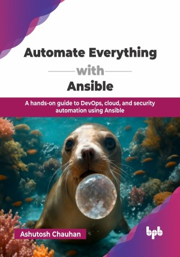

# Automate Everything with Ansible

A hands-on guide to DevOps, cloud, and security automation using Ansible.

This is the repository for [Automate Everything with Ansible
](https://bpbonline.com/products/automate-everything-with-ansible-1?variant=44758596059336),published by BPB Publications.

## About the Book
Ansible has emerged as the go-to solution for IT automation, streamlining complex processes and enhancing efficiency across diverse environments. This book is your definitive guide to becoming a skilled automation engineer and landing your dream job.

This book offers a brief overview of Ansible, starting with Ansible basics and then exploring its core features. It provides some practical examples of its core concepts like configuration management, application deployment, Kubernetes deployment, and Ansible for DevOps, helping its readers get some hands-on experience.  The journey then moves to specialized fields like cloud provisioning for AWS and Azure, configuration management of Linux and Windows Servers, and application deployment. The latter half of the book covers advanced topics such as network and security automation, DevOps practices, and managing Docker and Kubernetes containers, culminating with an introduction to Ansible Tower.

By the end of this book, you will be ready to begin your production journey. It will also help you understand the working of the production environment. After reading this book, you will be able to automate repeated tasks in your IT stream. You will also gain the crucial strategies needed to excel in interviews, secure a great job, and succeed in the corporate world.

## What You Will Learn
• Understand the basics of Ansible and its core concepts. 

• Create custom inventories and execute your first playbook.

• Create intuitive and reusable user-friendly Ansible roles.

• Learn to automate your repetitive tasks using Ansible. 

• Implement Ansible for DevOps and security practices.  

• Perform configuration management using key Ansible modules.
